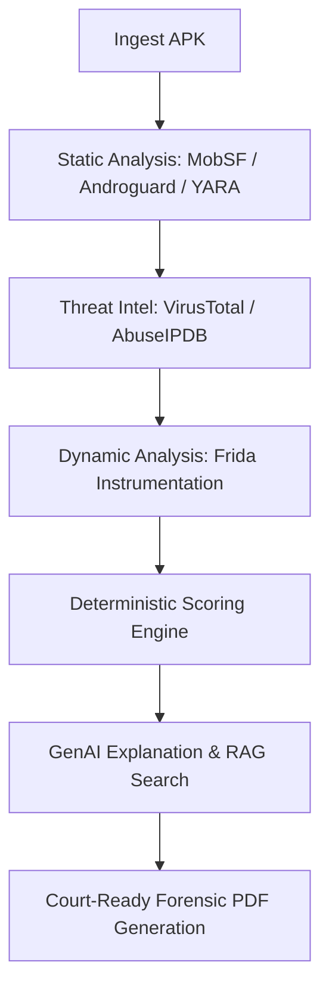

# SecureX — AI-Powered Malware Forensics Platform

Welcome to the **SecureX** documentation. This guide provides an end-to-end breakdown of the system architecture, code organization, prerequisites, deployment, and testing steps. It is designed to allow any developer to set up and run the entire platform on a new machine.

---

## 1. System Architecture & Codebase Map

The project is structured into a backend FastAPI service, a frontend Next.js dashboard, and supporting analysis scripts.

### Core Architecture Flow


### File & Component Reference

Below is the directory mapping of the backend modules under `app/`:

| Directory / File | Component | Role / Function |
| :--- | :--- | :--- |
| [app/main.py](file:///home/rishabh/Desktop/genai/app/main.py) | **FastAPI Server** | Exposes the REST API endpoints (e.g., `/api/v1/analyze`, `/api/v1/report/{case_id}`) and sets up WebSockets for streaming real-time analysis progress to the frontend. |
| [app/pipeline/orchestrator.py](file:///home/rishabh/Desktop/genai/app/pipeline/orchestrator.py) | **Orchestration Engine** | Coordinates the analysis phases sequentially: Ingest $\rightarrow$ Static Analyzer $\rightarrow$ Threat Intel $\rightarrow$ Dynamic Analyzer $\rightarrow$ scoring $\rightarrow$ LLM generation $\rightarrow$ RAG search $\rightarrow$ Forensic PDF generation. |
| [app/analysis/static_analyzer.py](file:///home/rishabh/Desktop/genai/app/analysis/static_analyzer.py) | **Static Scanning Coordinator** | Layered static scan orchestrating (1) MobSF Docker API upload/scans, (2) Local Androguard analysis fallback, (3) YARA rules, and (4) Repackaging check. |
| [app/analysis/apk_analyzer.py](file:///home/rishabh/Desktop/genai/app/analysis/apk_analyzer.py) | **Local Androguard Parser** | Standalone static parser utilizing Androguard to extract permissions, activities, receivers, services, custom intents, JNI libraries, and code obfuscation. |
| [app/analysis/yara_scanner.py](file:///home/rishabh/Desktop/genai/app/analysis/yara_scanner.py) | **YARA Scanner** | Compiles and scans files using custom rules inside `yara_rules/` looking for signature matches (e.g. keylogger hooks, C2 beacon patterns). |
| [app/analysis/dynamic_analyzer.py](file:///home/rishabh/Desktop/genai/app/analysis/dynamic_analyzer.py) | **Dynamic Instrumentation** | Manages the Android Emulator/USB connection. It spawns the target application using Frida, injects the agent script, and records hooked callbacks. |
| [frida_scripts/agent.js](file:///home/rishabh/Desktop/genai/frida_scripts/agent.js) | **Frida Instrumentation Script** | Written in JavaScript. Intercepts outbound TCP/HTTP traffic, SMS sends (silently blocking/stealing Banker actions), Location accesses, SSL contexts (defeating Certificate Pinning), `DexClassLoader` (Dynamic Code Loading), and JNI `loadLibrary`. |
| [app/analysis/indicators.py](file:///home/rishabh/Desktop/genai/app/analysis/indicators.py) | **Indicator Scoring Engine** | Contains `IndicatorEngine` and `ApkResultWrapper`. Computes the deterministic 0-100 risk score and maps indicators to MITRE ATT&CK techniques. |
| [app/threat_intel/intel.py](file:///home/rishabh/Desktop/genai/app/threat_intel/intel.py) | **Threat Intelligence** | Connects to VirusTotal (hash checks, vendor families, IPs) and AbuseIPDB to retrieve reputational metadata. |
| [app/ai/llm_client.py](file:///home/rishabh/Desktop/genai/app/ai/llm_client.py) | **LLM client wrapper** | Implements the automatic API fallback chain: Groq (Llama 3.3 70B) $\rightarrow$ Groq (Llama 3.1 8B) $\rightarrow$ Google Gemini (Gemini 2.5 Flash) $\rightarrow$ Offline Ollama. |
| [app/ai/agents.py](file:///home/rishabh/Desktop/genai/app/ai/agents.py) | **AI Agent Prompts** | Specializes prompts for code snippet analysis, behavioral narratives, explanation of deterministic scoring, and writing non-technical summaries for police/judges. |
| [app/ai/rag_engine.py](file:///home/rishabh/Desktop/genai/app/ai/rag_engine.py) | **RAG / Vector Database** | Indexes historical cases in a local ChromaDB instance to find the nearest matching malware families using permissions and C2 patterns. |
| [app/reporting/pdf_generator.py](file:///home/rishabh/Desktop/genai/app/reporting/pdf_generator.py) | **PDF Document Writer** | Generates court-ready PDF files using ReportLab. Styled using professional dark palettes (black, red, green, orange) to output summaries, timeline tables, and custody details. |
| [app/reporting/chain_of_custody.py](file:///home/rishabh/Desktop/genai/app/reporting/chain_of_custody.py) | **Custody Chain Logger** | Registers hashing, static completes, dynamic logs, and PDF output with timestamps to verify forensic integrity. |

---

## 2. Prerequisites & Environment Setup

Ensure the following programs are installed on the host operating system:

1. **Operating System**: Linux (Ubuntu/Kali preferred for security tools).
2. **Python**: `python3.10` or `python3.11`.
3. **Docker**: With `docker-compose` v2+ plugin installed.
4. **Android SDK Platform Tools**: Includes `adb` to control emulators/devices.
5. **NodeJS**: `v18+` (with `npm` or `yarn`) to run the frontend dashboard.

### Local Python Environment Setup
Navigate to the root directory and create a virtual environment:
```bash
# Create the virtual environment
python3 -m venv .venv

# Activate the virtual environment
source .venv/bin/activate

# Install dependencies
pip install -r requirements.txt
```

---

## 3. Threat Intel & LLM API Configuration (`.env`)

Duplicate [.env.example](file:///home/rishabh/Desktop/genai/.env.example) to `.env` and fill out the API keys:
```ini
# === LLM API Keys ===
GROQ_API_KEY=your_groq_api_key
GEMINI_API_KEY=your_gemini_api_key

# === Threat Intelligence API Keys ===
VIRUSTOTAL_API_KEY=your_virustotal_api_key
ABUSEIPDB_API_KEY=your_abuseipdb_key

# === Supabase (Optional DB Fallback) ===
SUPABASE_URL=https://your-project.supabase.co
SUPABASE_KEY=your-anon-key

# === MobSF ===
MOBSF_URL=http://localhost:8008
MOBSF_API_KEY=f12166c8517b7c160c7e445503781ba958eee7eaac69b5df0f0aa5849f4bbce3
```

---

## 4. Setting up Docker Services (MobSF & DBs)

The platform relies on a local instance of Mobile Security Framework (MobSF) running inside Docker.

The port configuration in [docker-compose.yml](file:///home/rishabh/Desktop/genai/docker-compose.yml) is mapped as **`8008:8000`** (Host `8008` routed to MobSF internal port `8000`). It also defines the environment variable `MOBSF_API_KEY` matching your `.env` value.

### Launch Docker Services
To spin up MobSF and the Redis queue containers, run:
```bash
docker compose up -d
```
Verify the MobSF status at: `http://localhost:8008`. The endpoint will respond with a `302 Redirect` to the login screen, confirming port-forwarding is correctly routing host requests.

---

## 5. Setting up the Android Emulator & Frida Server

Dynamic analysis requires an emulator with root access (e.g., Google APIs system image, *not* Google Play store image).

### 1. Launch the Emulator
Ensure your emulator is running:
```bash
# Check connected devices
adb devices
```

### 2. Match and Install Frida Server
The Frida Server version on the emulator **must match** the version of the `frida` Python package on your host machine.
```bash
# Check host Frida version
pip show frida
```

Download the corresponding `frida-server` binary for your emulator's architecture (e.g., `frida-server-XX.Y.Z-android-x86_64`) from the [Frida Releases page](https://github.com/frida/frida/releases).

### 3. Push and Run Frida Server
Run these commands to transfer and run Frida server on the target Android emulator:
```bash
# Push binary to the emulator
adb push frida-server /data/local/tmp/frida-server

# Grant root execution privileges
adb shell "chmod 755 /data/local/tmp/frida-server"

# Run frida-server in the background as root
adb shell "su -c /data/local/tmp/frida-server -D"
```

---

## 6. Running the Application

### Running the Backend Service
Ensure your virtual environment is active, then launch the FastAPI server using Uvicorn:
```bash
# From the root directory
uvicorn app.main:app --host 0.0.0.0 --port 8000 --reload
```
The FastAPI docs will be available at `http://localhost:8000/docs`.

### Running the Frontend Dashboard
Navigate to the `frontend/` directory, install Node packages, and run the development server:
```bash
cd frontend

# Install package dependencies
npm install

# Start Next.js in development mode
npm run dev
```
Open `http://localhost:3000` in your web browser to access the SecureX dashboard.

---

## 7. Forensic Scoring Criteria

The platform uses a deterministic, rule-based heuristic threat scoring engine. The threat score is calculated out of a maximum of 100 points:

1. **Threat Intelligence (VT)**: $+5$ points per detection engine flagging the hash (Capped at **50 points**).
2. **Static Analysis (YARA)**: $+20$ for Critical rules, $+15$ for High, $+5$ for Medium (Capped at **40 points**).
3. **Sensitive Permissions**: $+5$ points for each highly sensitive permission (e.g. `SEND_SMS`, `REQUEST_INSTALL_PACKAGES`) (Capped at **20 points**).
4. **Dynamic Frida Hook Hits**: $+20$ points for runtime triggers of `dynamic_code_load` or `sms_send`, $+10$ points for runtime connection/load events (Capped at **40 points**).
5. **Obfuscation**: $+10$ points if the static code `obfuscation_score` exceeds 5.

---

## 8. Verification & Test Suite

To verify the installation, you can run an end-to-end command line script that bypasses the frontend and tests the backend pipeline directly:

```bash
# Run the pipeline test script (simulates upload, static, VT, Frida, and AI)
python3 -m unittest discover tests/
```

Alternatively, you can run a custom test script to analyze a target APK file on your filesystem:
```bash
python3 -c "
import asyncio
from app.pipeline.orchestrator import pipeline
with open('/path/to/malicious.apk', 'rb') as f:
    res = asyncio.run(pipeline.run_full_analysis(f.read(), 'test.apk'))
print('Score:', res.get('threat_score'), 'Class:', res.get('classification'))
"
```
The console output will verify the scoring, the RAG index search match, and check that the AI non-technical summary and report PDF files were correctly created under `reports/`.
