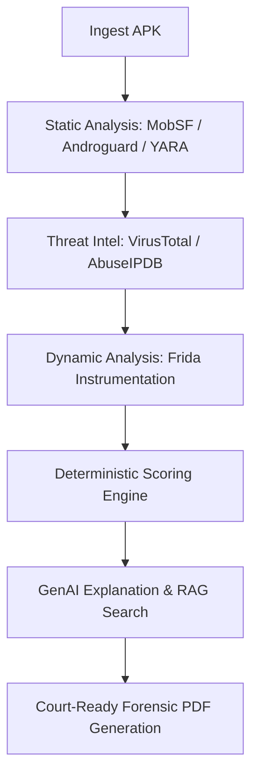

<div align="center">
  <h1>🛡️ SecureX</h1>
  <p><b>AI-Powered Malware Forensics Platform</b></p>
  <p>
    <a href="https://github.com/rizzzabh-06/SecureX/issues"></a>
    <a href="https://github.com/rizzzabh-06/SecureX/stargazers"></a>
    <a href="https://github.com/rizzzabh-06/SecureX/network/members"></a>
  </p>
</div>

---

**SecureX** is an automated, AI-driven digital forensics platform designed to analyze Android applications (APKs) for malicious behavior. By orchestrating static analysis, dynamic instrumentation, and threat intelligence, SecureX generates court-ready forensic reports and actionable threat narratives using advanced Large Language Models (LLMs) and Retrieval-Augmented Generation (RAG).

## 🧠 System Architecture & Workflow

The platform coordinates a multi-stage analysis pipeline, seamlessly linking deterministic scoring with generative AI reasoning.



## ✨ Key Features

* **Automated Static Analysis**: Extracts permissions, activities, receivers, services, and hardcoded secrets using Androguard and custom YARA rules.
* **Dynamic Instrumentation**: Hooks into live processes via Frida to monitor network traffic, SSL contexts, dynamically loaded code (`DexClassLoader`), and SMS/Location APIs.
* **Threat Intelligence Integration**: Correlates file hashes and IP addresses with VirusTotal and AbuseIPDB.
* **Multi-Agent GenAI Reasoning**: Utilizes Groq (Llama 3.3 70B) and Google Gemini (2.5 Flash) via a fault-tolerant backplane to generate massive, deeply technical forensic essays.
* **RAG Search**: Indexes historical malware cases in ChromaDB to find the nearest matching malware families using behavioral patterns.
* **Court-Ready PDF Reports**: Automatically formats findings into professional PDF documents with chain-of-custody cryptographic hashing.

---

## 🛠️ Codebase Map

| Directory / File | Component | Role / Function |
| :--- | :--- | :--- |
| `app/main.py` | **FastAPI Server** | Exposes REST API endpoints and sets up WebSockets for real-time progress streaming. |
| `app/pipeline/orchestrator.py` | **Orchestration Engine** | Coordinates the analysis phases sequentially. |
| `app/analysis/` | **Static & Dynamic Scanners** | Contains local Androguard parsers, custom YARA scanner logic, and the Frida dynamic analysis controller. |
| `frida_scripts/agent.js` | **Instrumentation Script** | Intercepts outbound TCP/HTTP traffic, SMS sends, Location accesses, and JNI `loadLibrary`. |
| `app/ai/` | **LLM & RAG Engine** | Implements the Groq/Gemini API fallback chains, specialized AI Agent prompts, and ChromaDB vector indexing. |
| `app/reporting/` | **Forensic Generator** | Generates court-ready PDF files and handles Chain of Custody logging. |

---

## 🚀 Installation & Setup Guide

Because some components (like the Android SDK, emulator images, and AI models) are massive, they are excluded from this Git repository. Follow these steps to set up the environment perfectly from scratch.

### 1. Prerequisites
* **OS**: Linux / macOS
* **Python**: `3.10` or `3.11`
* **Docker**: With `docker-compose` v2+ plugin installed.
* **NodeJS**: `v18+` (with `npm`)

### 2. Environment Configuration
Create your local `.env` file from the provided example:
```bash
cp .env.example .env
```
Open `.env` and fill in your API keys (Groq, Gemini, VirusTotal, etc.).

### 3. Install Dependencies
**Python Backend:**
```bash
python3 -m venv .venv
source .venv/bin/activate
pip install -r requirements.txt
```

**Next.js Frontend:**
```bash
cd frontend
npm install
```

### 4. Android SDK & Emulator Setup (Dynamic Analysis)
To perform dynamic analysis with Frida, SecureX requires a local headless Android Emulator. 

Run the automated setup script to download the Android command-line tools, system images, and the `frida-server` binary:
```bash
chmod +x scripts/setup_emulator.sh
chmod +x start_emulator.sh

./scripts/setup_emulator.sh
```
*(Note: This step requires a stable internet connection and will download several gigabytes of data.)*

### 5. Launch MobSF Services
SecureX relies on a local instance of Mobile Security Framework (MobSF) running inside Docker.
```bash
docker compose up -d
```
Verify MobSF is running at `http://localhost:8008`.

---

## 💻 Running the Platform

Once everything is installed, open three separate terminal windows to run the stack:

**Terminal 1: Start the Android Emulator**
```bash
./start_emulator.sh
```

**Terminal 2: Start the FastAPI Backend**
```bash
source .venv/bin/activate
uvicorn app.main:app --host 0.0.0.0 --port 8000 --reload
```

**Terminal 3: Start the Next.js Dashboard**
```bash
cd frontend
npm run dev
```

You can now access the SecureX dashboard at [http://localhost:3000](http://localhost:3000) and begin uploading APKs for forensic analysis!

---

<div align="center">
  <i>Built with ❤️ for Cyber Security Innovators</i>
</div>
